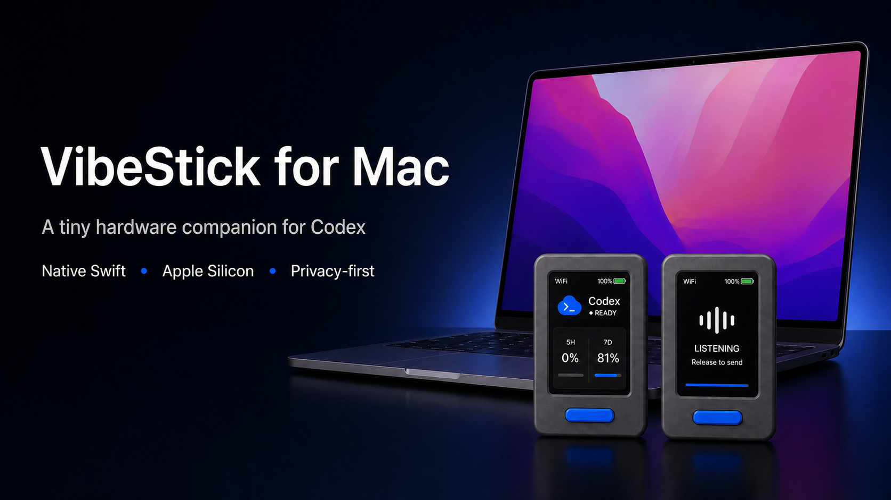

# VibeStick for Mac

[中文说明](README.zh-CN.md)

> **Project status:** independently maintained, macOS-focused derivative of
> [Gary Zhang's VibeStick](https://github.com/GaryGaryyy/VibeStick). The original
> copyright, MIT license, and project history are retained.



VibeStick for Mac turns an M5Stack StickS3 into a tiny desktop companion for
coding agents: glanceable status and quota windows on the device, plus
push-to-talk transcription into the active Mac workflow.

VibeStick targets M5Stack StickS3 hardware and is not an official M5Stack project. Third-party agent names such as Codex and Claude describe compatible local tools and integrations only.

## Why this project

- Keep Codex and Claude activity visible without covering the screen with
  another desktop window.
- Hold one physical button to record, transcribe, paste, and optionally confirm
  a message on the Mac.
- Install a native Swift App, Bridge, HUD, and Paste helper without requiring
  Python, Homebrew, Xcode, or ESP-IDF on an end-user Mac.
- Keep pairing, Keychain access, diagnostics, helper installation, USB access,
  firmware backup, and firmware writes behind explicit boundaries.

VibeStick for Mac was developed with OpenAI Codex as the primary engineering
collaborator across product design, implementation, testing, release
engineering, and safety review. The product also integrates with the local
Codex workflow to display session state and quota windows; it does not expose
Codex credentials through its Bridge API.

## 0.2.0 RC 1

The first delivery candidate uses a fully native Swift Bridge. The release DMG
contains the App plus native arm64 Bridge, HUD, and Paste components; end users do
not need Python, Homebrew, Xcode, or ESP-IDF. Version `0.2.0 (10)` supports Apple
Silicon on macOS 15 or newer. See the bilingual
[RC 1 release notes](docs/VIBESTICK_FOR_MAC_0.2.0_RC1_RELEASE_NOTES.md) for install,
upgrade, privacy, recovery, and known limitations.

This RC is ad-hoc signed and not notarized. Its local acceptance evidence is
recorded in the
[RC 1 local acceptance report](docs/VIBESTICK_FOR_MAC_0.2.0_RC1_LOCAL_ACCEPTANCE.md),
and GitHub release publication remains an explicit maintainer action.

### Install the RC

After the GitHub pre-release is published:

1. Download `VibeStick-for-Mac-0.2.0-rc.1.dmg` from
   [GitHub Releases](https://github.com/HanminYIN/VibeStick-for-Mac/releases).
2. Open the DMG and drag **VibeStick for Mac** to Applications.
3. Because RC 1 is ad-hoc signed and not notarized, the first launch may require
   Control-clicking the App in Finder and choosing **Open**.
4. Inspect the status first. Helpers, USB access, pairing, and firmware work
   begin only after their corresponding action and confirmation.

### What has been validated

| Area | RC 1 evidence |
| --- | --- |
| Native runtime | Swift App, Bridge, HUD, and Paste; arm64; macOS 15+ |
| Device workflow | USB pairing, per-device trust, Bonjour recovery, revision/ACK configuration sync |
| Voice workflow | StickS3 recording, ASR, HUD, paste, and confirmation states |
| Safety | Keychain-backed secrets, redacted diagnostics, transactional helper migration, separately confirmed firmware operations |
| Release | 270 Swift tests, 194 Python compatibility tests, isolated Release build, signed component checks, read-only DMG verification |

Detailed implementation history and real-device acceptance evidence live in
the milestone documents rather than on this front page:

- [M1 achievements and validation evidence](docs/VIBESTICK_FOR_MAC_M1_ACHIEVEMENTS.md)
- [M2 achievements and upstream comparison](docs/VIBESTICK_FOR_MAC_M2_ACHIEVEMENTS.md)
- [M2 implementation and acceptance boundary](docs/VIBESTICK_FOR_MAC_M2_IMPLEMENTATION.md)
- [M3-A achievements and upstream comparison](docs/VIBESTICK_FOR_MAC_M3A_ACHIEVEMENTS.md)
- [M3-B voice/send achievements](docs/VIBESTICK_FOR_MAC_M3B_ACHIEVEMENTS.md)
- [M3-C native ASR configuration achievements](docs/VIBESTICK_FOR_MAC_M3C_ACHIEVEMENTS.md)
- [VibeStick for Mac roadmap](docs/VIBESTICK_FOR_MAC_ROADMAP.md)
- [Native macOS build instructions](app/macos/README.md)

## Build from source: what you'll need

Normal RC users do not need this section. It is for contributors rebuilding
the firmware or running the repository development workflow.

- [ ] M5Stack StickS3 and a USB-C data cable.
- [ ] A Mac on the same network as the StickS3.
- [ ] Wi-Fi name and password. The Wi-Fi must be 2.4 GHz; StickS3 / ESP32-S3 does not support 5 GHz Wi-Fi.
- [ ] An ASR API key, model name, and base URL. SiliconFlow is one available
  provider: <https://cloud.siliconflow.cn/>.
- [ ] To show Claude 5H/7D usage: this feature is off by default (safer). It needs the Claude Code CLI (run `claude` then `/login` in Terminal) and `VIBE_STICK_CLAUDE_USAGE=on` in `.env`.

Building the firmware needs ESP-IDF v5.5.x — a one-time toolchain install (~1 GB, a few minutes). The install steps below set it up for you; no need to pre-install. Reference: Espressif's [ESP-IDF v5.5.1 ESP32-S3 guide](https://docs.espressif.com/projects/esp-idf/en/v5.5.1/esp32s3/get-started/index.html).

## Build and install from source

You can do this manually, or hand the command steps to an AI coding agent such as Claude Code and Codex.

> Legend: steps marked 👤 are PHYSICAL steps that need a human to act directly, such as plugging in the cable, long-pressing or short-pressing the power button, and granting macOS permissions in System Settings. AI agents should run the shell steps in order, then pause at each 👤 step and ask the user to complete it before continuing.

1. Clone the repo and create local config files:

```sh
git clone https://github.com/HanminYIN/VibeStick-for-Mac.git
cd VibeStick-for-Mac
./scripts/setup.sh
```

2. Fill the local config values the human prepared:

```sh
open -e firmware/sticks3/include/vibe_stick_secrets.h
open -e .env
```

In `vibe_stick_secrets.h`, set Wi-Fi SSID, Wi-Fi password, and the Mac bridge host. `scripts/setup.sh` tries to auto-fill `VIBE_STICK_BRIDGE_HOST` with the detected en0 LAN IP when the file still has the example placeholder.

In `.env`, set the ASR key and any provider choices. The default ASR example is SiliconFlow:

```sh
VIBE_STICK_ASR_PROVIDER=openai-compatible
VIBE_STICK_ASR_BASE_URL=https://api.siliconflow.cn/v1
VIBE_STICK_ASR_API_KEY=your-siliconflow-key
VIBE_STICK_ASR_MODEL=FunAudioLLM/SenseVoiceSmall
```

3. 👤 Plug the StickS3 into the Mac with the USB-C data cable.

4. 👤 Put the StickS3 into download mode: long-press the side power button until the blue LED double-blinks and the screen turns off. This is required for ESP32-S3 flashing.

5. Install ESP-IDF if it is not already present, then load it into the current shell. This is a one-time toolchain install with a large ~1 GB download and can take a few minutes. Run the load command in every new terminal before `idf.py`:

```sh
if [ ! -d "$HOME/esp/esp-idf" ]; then
  mkdir -p ~/esp && cd ~/esp
  git clone -b v5.5.1 --recursive https://github.com/espressif/esp-idf.git
  cd esp-idf && ./install.sh esp32s3
fi
. "$HOME/esp/esp-idf/export.sh"
```

Or install via Espressif's [official guide](https://docs.espressif.com/projects/esp-idf/en/v5.5.1/esp32s3/get-started/index.html). If `install.sh` fails, ensure `git`, `python3`, and `cmake` are present, or follow the official guide. Adjust the path if ESP-IDF is installed elsewhere.

6. Build and flash the firmware:

```sh
cd firmware/sticks3
idf.py -p <port> build flash
cd ../..
```

If you do not know the port, run:

```sh
ls /dev/cu.*
```

Wait for `Hash of data verified`.

7. 👤 Short-press the power button to wake the screen. The blue LED should turn off, the screen should turn on, and you should see the VibeStick home screen. Before networking is ready, it may show offline.

8. Install the local macOS bridge and HUD:

```sh
./scripts/install.sh
```

9. 👤 When macOS prompts that `VibeStick Paste` wants Accessibility control, click "Open System Settings" and enable it. This permission is needed for paste injection. The installed background items are named `VibeStick Bridge` and `VibeStick HUD` rather than generic `sh` or Python processes.

10. Check the setup:

```sh
./scripts/doctor.sh
```

Aim for all required checks to pass. Then glance at the StickS3: Codex / Claude status and 5H / 7D usage should show real values when the corresponding local provider data is available.

If Codex works but the Claude column shows `--%`, that is expected: Claude usage is disabled by default (safer), so to display it set `VIBE_STICK_CLAUDE_USAGE=on` and make sure Claude Code is logged in via `claude` and `/login`.

11. 👤 Open any text box, long-press the front blue button, speak, and release. VibeStick should transcribe and paste the text automatically.

For development without installing LaunchAgents, run `./scripts/dev.sh` from the repository root instead of `./scripts/install.sh`.

## Troubleshooting

### `command not found: idf.py`

ESP-IDF is installed but not loaded into the current shell, or it has not been installed yet. Source ESP-IDF's `export.sh`, then run `idf.py` again:

```sh
. $HOME/esp/esp-idf/export.sh
```

Adjust the path if your ESP-IDF checkout is somewhere else. Run this once in every new terminal before using `idf.py`.

### Flashing says "Device not configured" or cannot open the serial port

Unplug and replug the USB-C data cable. Put the StickS3 into download mode again: long-press the side power button until the blue LED double-blinks and the screen turns off. Run `ls /dev/cu.*` to find the port, then retry `idf.py -p <port> build flash`.

### StickS3 cannot join Wi-Fi

Use a 2.4 GHz Wi-Fi network. StickS3 / ESP32-S3 does not support 5 GHz Wi-Fi.

### Recording transcribes but does not paste

Grant Accessibility permission to `VibeStick Paste`. On macOS, open System Settings -> Privacy & Security -> Accessibility, then enable `VibeStick Paste`. Installed and repository-development builds use this named native helper. Re-running the installer preserves an unchanged helper and its permission identity; macOS may ask for permission again only when the helper itself changes.

### "No transcription adapter configured"

Configure ASR in `.env`, especially `VIBE_STICK_ASR_PROVIDER`, `VIBE_STICK_ASR_BASE_URL`, and `VIBE_STICK_ASR_API_KEY`, then run:

```sh
./scripts/install.sh
```

### Cannot find `.env`

`.env` is a hidden file. Open it with:

```sh
open -e .env
```

### Transcription fails or times out with SSL/network errors

The ASR provider is usually unreachable from your current network. For users
in China, try SiliconFlow at <https://cloud.siliconflow.cn/>. Otherwise
configure a reachable OpenAI-compatible ASR provider or your network proxy.

## Configuration

Do not commit real API keys, local tokens, Wi-Fi credentials, local logs, or generated recording files.

Empty values in `.env` generally mean "use the built-in default". `scripts/dev.sh` loads `.env` from the repository root. `scripts/install.sh` copies `.env` to `~/Library/Application Support/VibeStick/.env`, and the LaunchAgent runner loads that installed file.

### Core settings

- `VIBE_STICK_PROJECT_ROOT`: project root used for local Codex session observation.
- `VIBE_STICK_PROJECT_NAME`: optional display-name override.
- `VIBE_STICK_PROVIDER`: active provider selection, `auto`, `codex`, or `claude`; default `auto`.
- `VIBE_STICK_BRIDGE_TOKEN`: shared token required whenever the bridge binds outside loopback, such as `0.0.0.0`.
- `VIBE_STICK_MAX_RECORDING_AUDIO_BYTES`: max `/recording/audio` body size, default `2000000`.
- `VIBE_STICK_RECORDING_USE_MAC_MIC`: set to `0` to disable Mac microphone fallback.
- `VIBE_STICK_AUTO_ENTER`: set to `1` to press Return after pasting.

### ASR option 1: SiliconFlow (recommended default)

```sh
VIBE_STICK_ASR_PROVIDER=openai-compatible
VIBE_STICK_ASR_BASE_URL=https://api.siliconflow.cn/v1
VIBE_STICK_ASR_API_KEY=your-siliconflow-key
VIBE_STICK_ASR_MODEL=FunAudioLLM/SenseVoiceSmall
VIBE_STICK_ASR_LANGUAGE=zh
VIBE_STICK_ASR_TIMEOUT_SECONDS=15
VIBE_STICK_ASR_ATTEMPTS=2
```

Audio sent to a cloud ASR provider leaves the Mac.

### ASR option 2: any OpenAI-compatible provider

Use any provider that accepts `POST {base_url}/audio/transcriptions`.

```sh
VIBE_STICK_ASR_PROVIDER=openai-compatible
VIBE_STICK_ASR_BASE_URL=https://example.com/v1
VIBE_STICK_ASR_API_KEY=your-api-key
VIBE_STICK_ASR_MODEL=provider-model-name
```

Groq is also supported as an overseas preset:

```sh
VIBE_STICK_ASR_PROVIDER=groq
VIBE_STICK_ASR_API_KEY=your-groq-key
```

The legacy aliases `VIBE_STICK_GROQ_API_KEY`, `VIBE_STICK_GROQ_MODEL`, and `VIBE_STICK_GROQ_LANGUAGE` remain supported.

### ASR option 3: local command (offline)

```sh
VIBE_STICK_TRANSCRIBE_CMD=/path/to/transcribe-command
VIBE_STICK_TRANSCRIBE_TIMEOUT_SECONDS=120
```

The command receives the recording session JSON on stdin and should print the final transcript to stdout.

### Claude usage

To see Claude 5H/7D usage, use `VIBE_STICK_PROVIDER=claude` or `VIBE_STICK_PROVIDER=auto`, set `VIBE_STICK_CLAUDE_USAGE=on`, and make sure Claude Code CLI has logged in through Terminal with `claude` and `/login`.

- `VIBE_STICK_CLAUDE_USAGE`: set to `on` to fetch real Claude Code subscription usage; default `off`.
- `CLAUDE_CODE_OAUTH_TOKEN`: optional Claude Code OAuth access token. If unset, the bridge tries local Claude Code keychain/file credentials.
- `VIBE_STICK_CLAUDE_USAGE_INTERVAL_SECONDS`: Claude usage poll cadence, default `300`, minimum `30`.

Claude usage support calls an undocumented Anthropic endpoint using the user's local Claude Code subscription credentials and client headers. It is opt-in, may break without notice, and never exposes the token or raw endpoint response through the bridge HTTP API. If no successful Claude usage snapshot has ever been captured, the StickS3 shows `--%`; after a successful snapshot, temporary usage refresh failures keep the last known values and mark them stale.

## Project layout

```text
VibeStick-for-Mac/
  README.md
  README.zh-CN.md
  .env.example
  docs/
  firmware/sticks3/
  bridge/src/vibe_stick/
  app/macos/VibeStick.xcodeproj/
  app/macos/VibeStickApp/
  app/macos/VibeStickAppTests/
  app/macos/VibeStickBridge/
  app/macos/VibeStickHUD/
  app/macos/VibeStickPaste/
  scripts/
  tests/
```

## Checks

The Python suite below protects compatibility with the retained reference
implementation; it is a developer check, not an end-user runtime dependency.

```sh
python3 -m compileall -q bridge/src tests
PYTHONPATH=bridge/src python3 -m unittest discover -s tests
bash -n scripts/setup.sh scripts/doctor.sh scripts/install.sh
scripts/verify-macos-build.sh
```

Normal RC App/DMG builds use the tracked, source-bound accepted payload under
`release/firmware` and do not require ESP-IDF. Rebuilding the firmware itself
still requires ESP-IDF and renewed acceptance:

```sh
cd firmware/sticks3
. $HOME/esp/esp-idf/export.sh
idf.py build
```

## Current limits

- RC 1 has a native Swift runtime and isolated App/DMG acceptance. Strict clean-machine first-install and fault-rollback acceptance remains unexecuted because no second clean Mac or clean external boot environment was available; this is neither a pass nor a failure.
- M3-B has passed controlled real-device acceptance, and M3-C has passed an explicitly authorized SiliconFlow fixed-audio GUI test without using a Mac microphone. Their implementation and evidence are retained in the repository milestones.
- The firmware targets M5Stack StickS3 only.
- The Mac app targets Apple Silicon and macOS 15 or newer; it is ad-hoc signed and not notarized.
- Codex quota normally follows local session `rate_limits` events without starting an extra process. A manual refresh uses the version-bound local Codex app-server protocol once for a fresher account-wide reading; neither source is a public quota API.
- Claude usage comes from an undocumented Claude Code OAuth endpoint and is disabled by default.
- ASR reliability depends on microphone capture, uploaded PCM quality, provider availability, and configured model.

## Contributing & Security

Contributions welcome — see [CONTRIBUTING.md](CONTRIBUTING.md). To report a vulnerability,
see [SECURITY.md](SECURITY.md) (please report privately).

## License

The original VibeStick and the VibeStick for Mac modifications are released
under the MIT License. The original copyright notice is retained; see
[LICENSE](LICENSE) and [NOTICE](NOTICE).
Bundled firmware and font notices are listed in
[Third-party licenses](docs/THIRD_PARTY_LICENSES.md).
